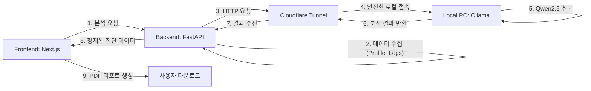

# AI 도입 전략: 데이터 기반 행동 코칭 및 리포트 시스템

## 1. 비전 및 목표
**"단순한 기록 도구를 넘어, 나보다 내 강아지를 더 잘 아는 AI 코치"**

기존의 정형화된 훈련 커리큘럼(Rule-based)에 **생성형 AI(LLM)의 맥락 이해 능력**을 더하여, 정답이 아닌 **"해답"**을 제시하는 것을 목표로 합니다. 특히, 수집된 방대한 데이터(`DogEnv`, `BehaviorLogs`)를 분석하여 보호자가 놓치고 있는 패턴을 발견하고, 이를 전문가 수준의 리포트로 제공하여 서비스 가치를 극대화합니다.

## 2. 해결하고자 하는 문제 (Pain Points)
1.  **데이터의 파편화**: 로그를 100개 기록해도, 보호자는 "그래서 우리 강아지가 왜 이러지?"에 대한 결론을 내리기 어렵습니다.
2.  **훈련의 단조로움**: 정해진 7일 챌린지는 개별 강아지의 돌발 상황(컨디션 난조, 새로운 자극)을 반영하지 못합니다.
3.  **공유의 어려움**: 훈련 성과를 수의사나 트레이너, 친구들에게 보여주고 싶지만 "앱 좀 봐줘"라고 말하기엔 접근성이 낮습니다.

## 3. 핵심 기능: AI Premium Report (ReportDocument.tsx 연동)

### A. 데이터 입력 구조 (Context Injection)
AI에게 제공되는 프롬프트는 다음 3가지 레이어로 구성됩니다.

1.  **Static Profile (`Dog` + `DogEnv`)**:
    *   기본 정보: 품종, 나이, 성별, 중성화 여부.
    *   환경 정보: 주거 형태(아파트/주택), 가족 구성원, 주 양육자.
    *   성향/건강: 타고난 기질(겁이 많음 등), 만성 질환, 과거 훈련 실패 이력.
2.  **Dynamic Context (`BehaviorLogs` - Recent 30 days)**:
    *   빈도 분석: 가장 많이 발생한 문제 행동 TOP 3.
    *   강도 추이: 최근 1주일간의 행동 강도(Intensity) 변화 그래프 데이터.
    *   시간 패턴: 주로 발생하는 시간대 (예: "보호자 퇴근 직후인 19~21시 집중").
3.  **User Inquiry (Optional)**:
    *   보호자가 이번 리포트에서 중점적으로 알고 싶은 고민 (예: "요즘 산책만 나가면 짖어요").

### B. 리포트 구성 (Output Structure)
`ReportDocument.tsx`를 통해 생성될 PDF는 단순한 나열이 아닌, **"진단서 + 편지"**의 형태를 띱니다.

1.  **종합 진단 점수 (Training Health Score)**:
    *   로그 데이터를 기반으로 산출된 '안정성', '규칙성', '보호자 호응도' 점수.
2.  **숨겨진 패턴 리포트 (Insight)**:
    *   *AI 분석 예시*: "초코는 주로 **'현관 밖 소음'**에 예민하게 반응하고 있습니다. 특히 기록을 보면 **비 오는 날(산책을 못 나간 날)** 짖음 빈도가 평소보다 40% 높습니다. 이는 활동량 부족이 짖음으로 표출되는 것으로 보입니다."
3.  **다음 주 맞춤 솔루션 (Action Plan)**:
    *   기존 커리큘럼을 재조합하여 제시.
    *   *AI 제안*: "다음 주는 '현관 둔감화 교육'보다는 **'실내 노즈워크 활동량 늘리기'**를 우선 과제로 삼으세요."
4.  **강아지의 속마음 (The Dog's Voice)**:
    *   데이터에 기반한 감성적 편지.
    *   *내용*: "엄마, 아까 배달 아저씨 왔을 때 제가 짖어서 놀라셨죠? 사실 저도 무서워서 그랬어요. 그래도 엄마가 무시하고 기다려줘서 금방 진정할 수 있었어요."

## 4. 로컬 개발 및 AI 터널 구축 (System Architecture)

현재 DogCoach는 오라클 클라우드 상용화 전, 개발 효율성을 극대화하기 위해 **로컬 LLM 자원 공유 방식**을 사용합니다. 이를 통해 GPU 비용 없이 강력한 AI 기능을 개발하고 테스트할 수 있습니다.

### A. 작동 원리 (Working Principle)
시스템은 다음과 같은 데이터 흐름으로 작동합니다:



1.  **Context Injection**: 백엔드가 DB에서 해당 강아지의 모든 정보(기질, 건강, 최근 10개 로그)를 긁어모아 AI를 위한 '맞춤형 도서관'을 만듭니다.
2.  **Remote Execution**: 백엔드 서버가 구름 너머(Cloudflare)를 통해 사용자 PC의 CPU/GPU 자원을 빌려 AI 연산을 수행합니다.
3.  **Heuristic Parsing**: AI가 내놓은 긴 텍스트 답변을 백엔드가 '진단', '솔루션', '편지' 섹션으로 자동 분리하여 프론트엔드에 전달합니다.

### B. 로컬 PC 설정 가이드 (Execution Guide)

#### 1. Ollama 환경 설정 (최초 1회)
Ollama가 외부(터널)의 요청을 허용하도록 Windows 환경 변수를 설정해야 합니다.
- **변수 추가**: 
    - `OLLAMA_ORIGINS`: `*` (모든 도메인 허용)
    - `OLLAMA_HOST`: `0.0.0.0` (모든 IP 바인딩)
- **적용**: 설정 후 작업 표시줄에서 Ollama를 **완전히 종료(Quit)** 후 다시 실행하세요.

#### 2. 터널 활성화 (개발 시 수시)
PowerShell에서 아래 명령어를 입력하여 로컬 AI를 외부로 노출합니다.
```powershell
./cloudflared.exe tunnel --url http://localhost:11434
```
- 실행 후 생성되는 `https://...trycloudflare.com` 주소를 확인하세요.

#### 3. 프로젝트 연동
- **Backend**: `.env` 파일의 `AI_API_URL`을 위에서 생성된 터널 주소로 업데이트합니다.
- **Frontend**: `.env.local`의 `NEXT_PUBLIC_API_URL`이 현재 백엔드를 바라보는지 확인합니다.

## 5. SNS 바이럴 및 공유 전략 (Growth Loop)

### 전문가 공유 모드
수의사나 훈련사에게 URL 하나만 보내면 웹에서 바로 상세 차트와 로그를 볼 수 있는 **'Expert View'** 링크 생성 기능.
*   앱 설치 없이 웹에서 바로 확인 가능하도록 하여, 병원 진료 시 보조 자료로 활용 유도.

## 5. 단계별 도입 로드맵 (Implementation Plan)

### Phase 1: MVP (로컬 LLM 요약)
*   **목표**: `ReportDocument.tsx` 내 `insight` 필드를 로컬 AI가 작성.
*   **구현**:
    *   Backend: `POST /api/coach/analyze` 엔드포인트 구현.
    *   Infra: `ServerPlan.md`에 명시된 **Oracle Cloud + Ollama (Qwen2.5-1.5B)** 환경 구축.
    *   Prompt: 한국어 구어체 및 ABC 분석에 최적화된 시스템 프롬프트 작성.
    *   Frontend: 리포트 다운로드 버튼 클릭 시 AI 분석 요청 -> 완료 시 PDF 생성.

### Phase 2: 구조화된 훈련 제안
*   **목표**: 단순 텍스트가 아닌, JSON 형태의 Action Plan을 받아와 앱 내 '오늘의 미션'을 동적으로 변경.
*   **구현**: `AICoaching` 테이블에 분석 결과 저장 및 Dashboard 연동.

### Phase 3: 전문가 및 보호자 공유 확장
*   **목표**: 'Expert View' 링크 활성화 및 보호자 간 커뮤니티 공유 기능.
*   **구현**: 공개/비공개 설정 가능한 웹 뷰어 페이지 및 공유 링크 생성 API.

---
**결론**: DogCoach의 AI 도입은 단순한 기능 추가가 아니라, **"보호자의 불안감 해소"**와 **"반려견과의 정서적 유대 강화"**라는 핵심 가치를 전달하는 가장 강력한 수단이 될 것입니다.
