# DogCoach — 프로젝트 시각화

> Mermaid 기반 다이어그램. GitHub, Notion, VS Code(Mermaid Preview)에서 렌더링 가능.

---

## 1. 시스템 아키텍처

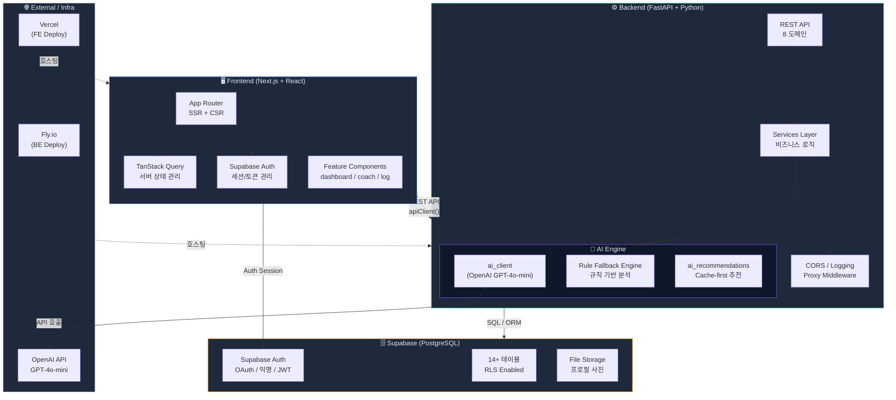

---

## 2. 핵심 데이터 흐름 (행동 로그 → AI 추천)

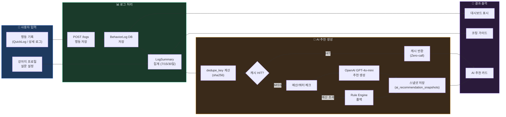

---

## 3. ERD (데이터베이스 관계도)

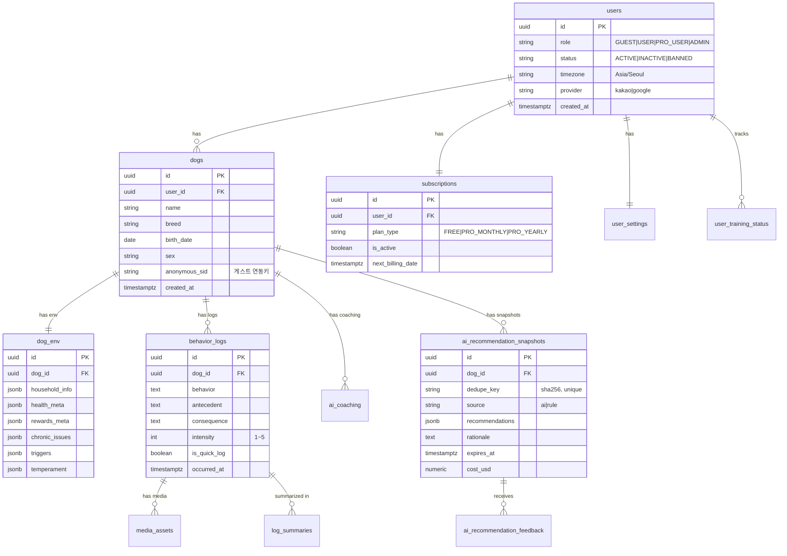

---

## 4. 프론트엔드 라우트 & 컴포넌트 트리

```mermaid
graph TD
  subgraph Routes["📁 App Router"]
    Root["/ → 온보딩/로그인"]
    subgraph PublicGroup["(public) — 비인증"]
      Onboarding["/survey<br/>온보딩 설문"]
      Login["/login<br/>소셜 로그인"]
      Result["/result<br/>분석 결과"]
      Legal["/privacy, /terms"]
    end
    subgraph AppGroup["(app) — 인증 필요"]
      Dashboard["/dashboard<br/>메인 대시보드"]
      Coach["/coach<br/>AI 코칭 가이드"]
      Log["/log<br/>행동 로그"]
      Dog["/dog<br/>강아지 프로필"]
      Settings["/settings<br/>알림/AI 페르소나"]
    end
    AuthCallback["/auth/callback<br/>OAuth 콜백"]
  end

  subgraph DashboardComponents["📊 Dashboard 컴포넌트"]
    DH["DashboardHeader"]
    QLW["QuickLogWidget"]
    RLL["RecentLogList"]
    CLD["CreateLogDialog"]
    ELD["EditLogDialog"]
    BNR["CoreDataRequiredBanner"]
  end

  subgraph CoachComponents["🤖 Coach 컴포넌트"]
    CJM["ChallengeJourneyMap"]
    CAO["ChallengeOnboardingModal"]
    MAO["MissionActionOverlay"]
  end

  subgraph SharedLayout["🧩 Layout 컴포넌트"]
    Header["Header"]
    Sidebar["Sidebar"]
    BottomNav["BottomNav"]
    Footer["Footer"]
  end

  Root --> Login
  Dashboard --> DH
  Dashboard --> QLW
  Dashboard --> RLL
  QLW --> CLD
  RLL --> ELD
  Coach --> CJM
  Coach --> CAO
  CJM --> MAO
  AppGroup --> Header
  AppGroup --> BottomNav

  style Routes fill:#1e293b,stroke:#3b82f6,color:#e2e8f0
  style DashboardComponents fill:#1e293b,stroke:#f59e0b,color:#e2e8f0
  style CoachComponents fill:#1e293b,stroke:#8b5cf6,color:#e2e8f0
  style SharedLayout fill:#1e293b,stroke:#10b981,color:#e2e8f0
```

---

## 5. 상태 관리 흐름 (TanStack Query + useAuth)

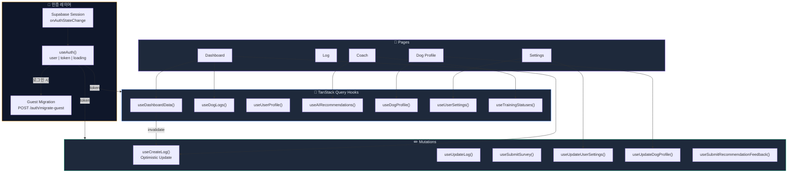

---

## 6. 사용자 여정 (User Journey)

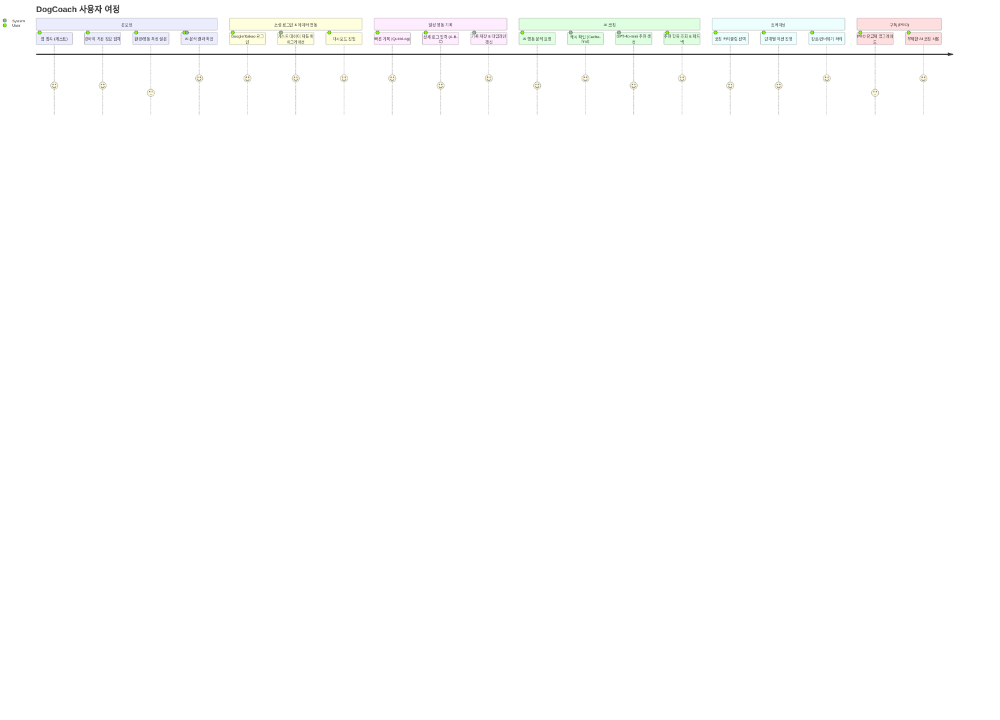

---

## 7. API 엔드포인트 맵

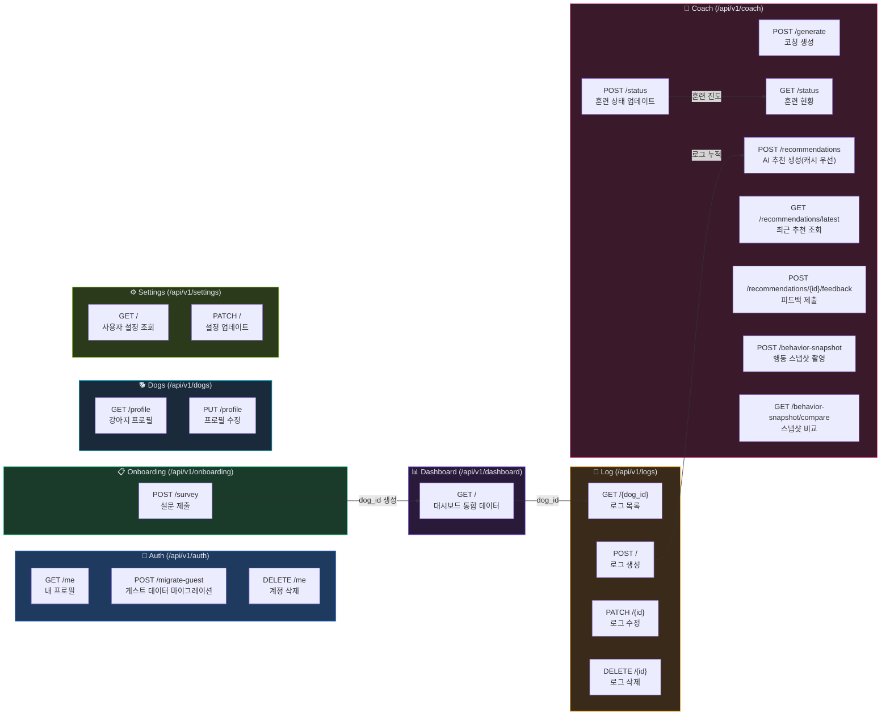

---

## 8. AI 코칭 엔진 파이프라인

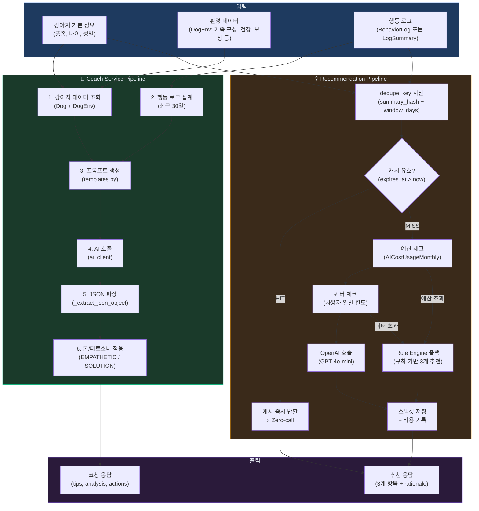

---

## 9. BE ↔ FE 미러 구조

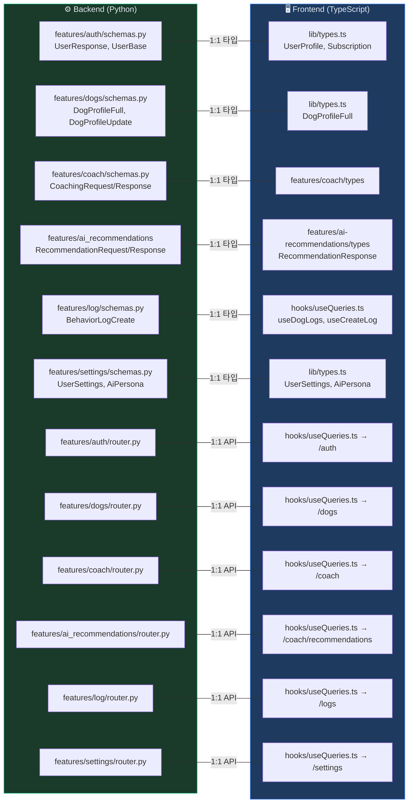

---

## 10. 기술 스택 요약

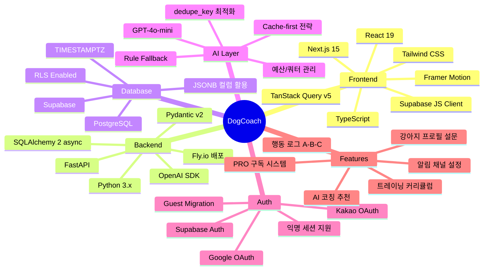

---

## 11. 인증 흐름 (Auth Flow)

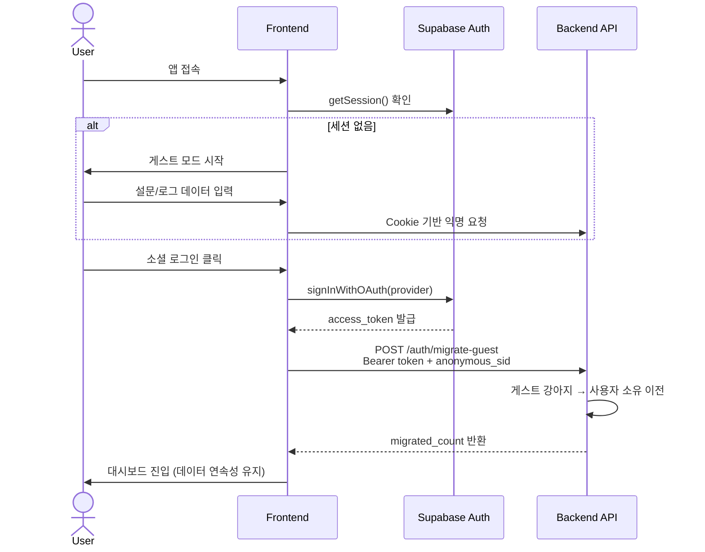
